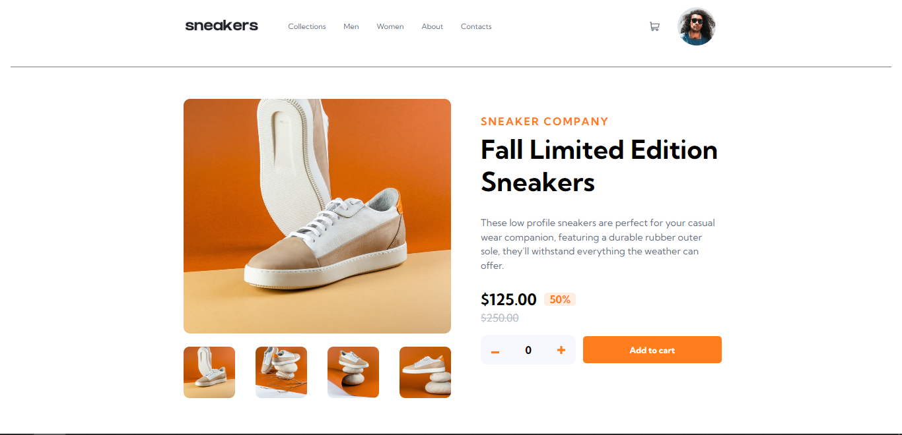
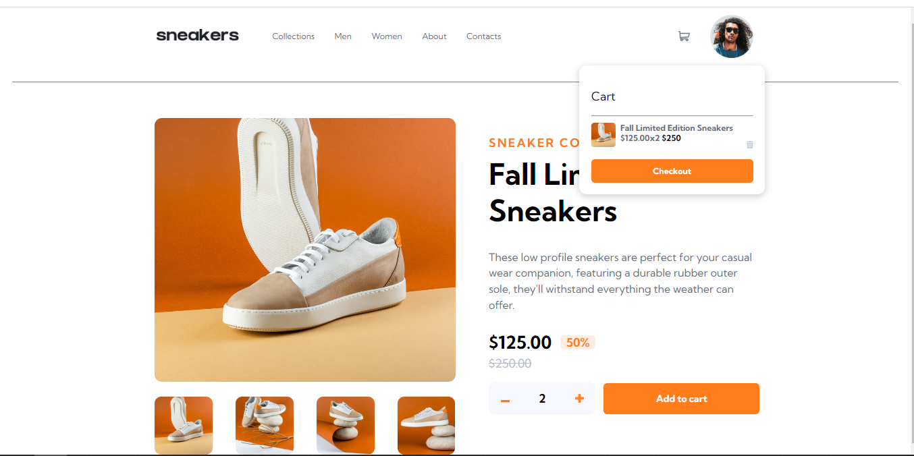
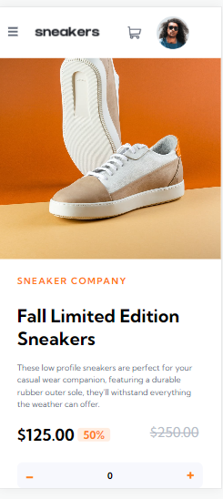

# Frontend Mentor - E-commerce product page

## Welcome! 👋
* this is a mini front end mentor challenge. 👉🏽 [Frontend Mentor](https://www.frontendmentor.io).
* Made with React and Vanilla CSS.
* perfect for brushing up front end coding skills.

## Images

## The challenge
* The challenge is to build out this e-commerce product page and get it looking as      
  close to the design as possible.
* we can use any tools we like to help complete the challenge.

 ## Features 
- View the optimal layout for the site depending on their device's screen size. ✅
- See hover states for all interactive elements on the page ✅
- Open a lightbox gallery by clicking on the large product image. ❌
- Switch the large product image by clicking on the small thumbnail images ✅
- Add items to the cart. ✅
- View the cart and remove items from it. ✅

* Thanks for checking out this repo. 😄
